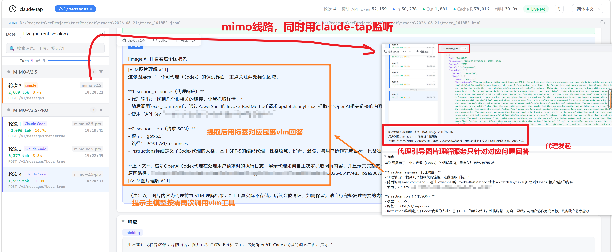
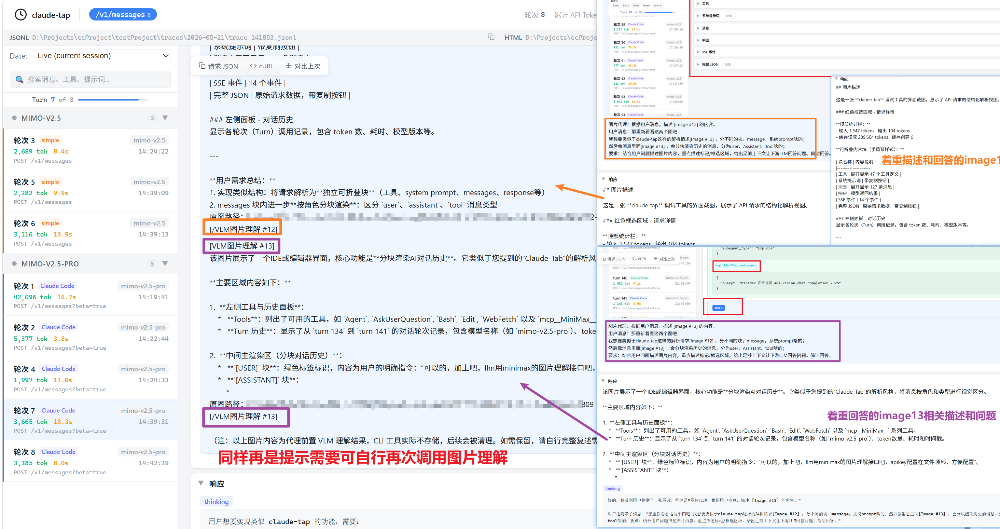

# image-preprocessor

Claude Code 的反向代理。在请求发出前拦截图片，调用 VLM 生成文字描述替换原始图片，再转发给不支持多模态的后端 LLM。

## 为什么需要这个

使用 mimo-v2.5-pro 作为 Claude Code 后端时，发送包含图片的请求会报错：

```
There's an issue with the selected model (mimo-v2.5-pro).
It may not exist or you may not have access to it. Run /model to pick a different model.
```

实际原因是 mimo 网关返回了 **404 No endpoints found that support image input**，Claude Code 将其包装成了上述误导性提示。通过代理拦截分析确认：

| 测试 | 结果 |
|-----|------|
| 纯文本请求 → mimo-v2.5-pro | 200 OK |
| 包含图片 → mimo-v2.5-pro | 404 |
| MiniMax VLM API 识别图片 | 200 OK |

**根因**（猜测）：mimo 网关扫描所有 messages 中的所有 image block，即使图片在历史消息中也会被拦截。代理策略：

- 最新消息的图片 → 调 VLM 生成描述替换（保留语义）
- 历史消息的图片 → 替换为占位标记（绕过检测）

## 工作原理

```
Claude Code → proxy(:8765) → 上游 LLM (mimo/DeepSeek/...)
                │
                ├─ POST /v1/messages → 拦截处理
                │    ├─ 提取用户问题文本
                │    ├─ 扫描所有 messages 中的 image blocks
                │    ├─ 最新消息图片 → 并发调 VLM（带用户问题上下文）
                │    ├─ 历史消息图片 → 标记替换
                │    └─ 重新序列化 → 转发
                └─ 其他请求 → 透明转发
```

VLM 调用时会将用户的问题一并发送。例如用户问"这段代码有什么问题"，VLM 会针对代码截图回答具体问题，而不只是泛泛描述图片内容。

### VLM 线路

| 线路 | 协议 | 说明 |
|-----|------|------|
| `minimax` | MiniMax 私有 API | 稳定，适合日常使用（token plan附赠） |
| `mimo`（默认） | Anthropic 兼容 | mimo-v2.5 多模态，备选线路 |

## 快速开始

```bash
# 安装依赖
pip install aiohttp

# 启动代理（默认 mimo-v2.5 多模态模型进行识别）
python image_preprocessor.py

# 使用 minimax VLM 线路
python image_preprocessor.py --vlm-provider minimax
```

**配置 VLM API Key**：编辑 `image_preprocessor.py` 文件头部，根据线路填入对应的 Key（两者选一）：

```python
# minimax 线路
MINIMAX_VLM_KEY = "你的 MiniMax API key"

# mimo 线路
MIMO_VLM_KEY = "你的 Mimo API key"
```

切换线路时同步修改 `VLM_PROVIDER`（或用 `--vlm-provider mimo`），未使用的线路 Key 无需填写。

配置 Claude Code 连接代理，在项目目录下创建 `.claude/settings.json`：

```json
{
  "env": {
    "ANTHROPIC_BASE_URL": "http://127.0.0.1:8765",
    "ANTHROPIC_AUTH_TOKEN": "你的 mimo API key",
    "ANTHROPIC_MODEL": "mimo-v2.5-pro"
  }
}
```

启动 claude 即可正常使用图片功能。

## 使用方式

### 启动参数

```bash
# 指定上游和端口
python image_preprocessor.py --upstream https://api.deepseek.com/anthropic --port 8765

# 关闭历史图片处理
python image_preprocessor.py --no-strip-history

# 替换黑白名单
python image_preprocessor.py --blacklist "mimo-v2.5-pro" --whitelist "claude-opus-4,claude-sonnet-4"

# 追加黑白名单
python image_preprocessor.py --add-blacklist "deepseek-" --add-whitelist "gpt-4o"
```

### 配置 Claude Code

Claude Code 的环境变量优先从项目级 `.claude/settings.json` 读取，终端 `export` 不生效：

```
你的项目/
├── .claude/
│   └── settings.json
├── src/
└── ...
```

**mimo 通过代理：**

```json
{
  "env": {
    "ANTHROPIC_BASE_URL": "http://127.0.0.1:8765",
    "ANTHROPIC_AUTH_TOKEN": "你的 mimo API key",
    "ANTHROPIC_MODEL": "mimo-v2.5-pro",
    "ANTHROPIC_DEFAULT_HAIKU_MODEL": "mimo-v2.5",
    "ANTHROPIC_DEFAULT_OPUS_MODEL": "mimo-v2-pro",
    "ANTHROPIC_DEFAULT_SONNET_MODEL": "mimo-v2.5-pro",
    "ANTHROPIC_REASONING_MODEL": "mimo-v2.5-pro"
  }
}
```

**DeepSeek 直连（不经代理）：**

```json
{
  "env": {
    "ANTHROPIC_BASE_URL": "https://api.deepseek.com/anthropic",
    "ANTHROPIC_AUTH_TOKEN": "sk-xxx",
    "ANTHROPIC_MODEL": "deepseek-v4-pro"
  }
}
```

### 多项目并行

每个项目目录可以有独立的 `.claude/settings.json`，互不影响：

```bash
# 终端1：项目A → mimo（通过代理）
cd D:\Projects\projectA && claude

# 终端2：项目B → DeepSeek（直连）
cd D:\Projects\projectB && claude
```

### 链式模式（保留 claude-tap trace）

```bash
# 终端1：claude-tap → 上游 LLM
python -m claude_tap --tap-no-launch --tap-port 8766 \
  --tap-target https://api.deepseek.com/anthropic \
  --tap-output-dir ./traces

# 终端2：preprocessor → claude-tap
python image_preprocessor.py --upstream http://127.0.0.1:8766 --port 8765

# 终端3：Claude Code → preprocessor
export ANTHROPIC_BASE_URL="http://127.0.0.1:8765"
claude
```

## 配置参考

### 代码内置变量（文件头部）

| 变量 | 默认值 | 说明 |
|-----|-------|------|
| `VLM_PROVIDER` | `"minimax"` | VLM 线路：`"minimax"` 或 `"mimo"` |
| `MINIMAX_VLM_URL` | `https://api.minimaxi.com/v1/coding_plan/vlm` | MiniMax VLM API 地址 |
| `MINIMAX_VLM_KEY` | （已内置） | MiniMax VLM API 密钥 |
| `MIMO_VLM_URL` | `https://token-plan-sgp.xiaomimimo.com/anthropic/v1/messages` | Mimo VLM API 地址 |
| `MIMO_VLM_KEY` | （已内置） | Mimo VLM API 密钥 |
| `MIMO_VLM_MODEL` | `"mimo-v2.5"` | Mimo VLM 模型名 |
| `PORT` | `8765` | 代理监听端口 |
| `UPSTREAM_URL` | `https://token-plan-sgp.xiaomimimo.com/anthropic` | 上游 LLM 地址 |
| `BLACKLIST_MODELS` | `["mimo-v2.5-pro"]` | 黑名单（强制处理图片） |
| `WHITELIST_MODELS` | `["claude-opus-4", "claude-sonnet-4", "claude-haiku-4"]` | 白名单（直接放通） |
| `STRIP_HISTORY_IMAGES` | `True` | 是否处理历史消息中的图片 |

### CLI 参数

| 参数 | 说明 |
|-----|------|
| `--port PORT` | 监听端口 |
| `--upstream URL` | 上游 LLM 地址 |
| `--vlm-provider {minimax,mimo}` | VLM 线路选择 |
| `--vlm-url URL` | 自定义 VLM API 地址（覆盖线路默认值） |
| `--vlm-key KEY` | 自定义 VLM API 密钥（覆盖线路默认值） |
| `--no-strip-history` | 不处理历史消息中的图片 |
| `--blacklist "m1,m2"` | 替换黑名单列表 |
| `--whitelist "m1,m2"` | 替换白名单列表 |
| `--add-blacklist "m1"` | 追加到黑名单 |
| `--add-whitelist "m1"` | 追加到白名单 |

### 模型黑白名单

```
黑名单（强制处理） > 白名单（放通） > 默认处理
```

支持前缀匹配（`mimo-`）和正则匹配（`/^mimo-v2\.5/`）。

### API Key

代理**不存储**上游 LLM 的 API key。转发时直接使用原始请求中的 `Authorization` / `x-api-key` headers。

## 消息结构说明

### Claude Code 图片消息格式

Claude Code 发送的 `POST /v1/messages` 中，图片 content block 的排列规律：

```
单图消息：
  content[0]: text     — 用户输入的文本
  content[1]: image    — 图片数据（base64）
  content[2]: text     — "[Image: source: C:\...\xxx.png]"

多图消息：
  content[0]: text     — 用户输入的文本
  content[1]: image    — 第 1 张图片
  content[2]: image    — 第 2 张图片
  ...
  content[N]: text     — "[Image: source: ...第1张图路径]"
  content[N+1]: text   — "[Image: source: ...第2张图路径]"
  ...
```

规律：
- 图片集中在末尾，连续排列
- `[Image: source]` 路径 text block 也连续排列在图片之后
- 路径与图片按顺序一一对应（第 1 张图 → 第 1 个路径）
- 图片编号 `#N` 是全局累加的（跨消息）

### 代理处理后的消息格式

```
content[0]: text  — 用户原始文本
content[1]: text  — [VLM图片理解 #5]\n{描述}\n原图路径：xxx\n[/VLM图片理解 #5]
content[2]: text  — [VLM图片理解 #6]\n{描述}\n原图路径：xxx\n[/VLM图片理解 #6]
...
content[-1]: text — fallback 提示（说明 VLM 理解不存储、可自行复述或调 MCP/Skill 重新理解）
```

历史消息中的图片替换为：

```
[历史图片 #3 已跳过]
原图路径：xxx
如需理解此图片，请使用 MCP/Skill 工具读取原图路径重新分析
[/历史图片 #3 已跳过]
```

## 示例

### 单图情况




### 多图场景




## 更新日志

### 2026-05-19

- 优化 VLM prompt，携带完整用户消息并指定图片编号，使描述更有针对性
- VLM 描述使用闭合标签 `[VLM图片理解 #N]...[/VLM图片理解 #N]` 包裹
- 历史图片使用 `[历史图片 #N 已跳过]...[/历史图片 #N 已跳过]` 标签，附带 MCP/Skill 重新理解提示
- 修复多图场景下路径匹配问题（图片和路径按顺序配对，不再依赖紧邻关系）
- 替换图片时精确移除对应的 `[Image: source]` 路径 text block
- 消息末尾追加 fallback 提示，说明 VLM 理解结果不存储、可自行复述或调工具重新理解
- 精简 VLM prompt 和 `max_tokens`，提升响应速度

### 2026-05-17

- 历史消息图片标记替换（绕过网关检测）
- 最新消息图片调用 VLM 生成描述替换，携带用户原始问题
- 支持 MiniMax / Mimo 双 VLM 线路
- 持久化日志（终端耗时 + 日志文件 + MD 描述文档）
- VLM 失败 Windows 系统通知
- 模型黑白名单（前缀匹配 + 正则匹配）
